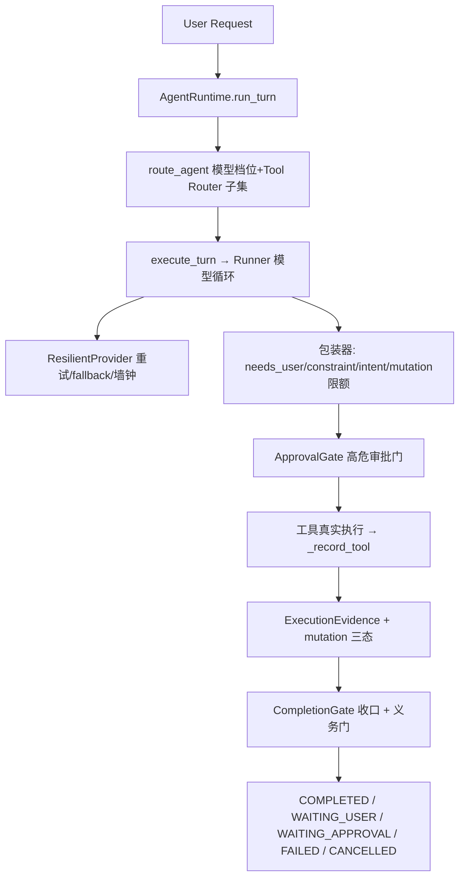

# FORGE-RUNTIME-TRUTH-AUDIT（第一阶段 · Phase 0 完成）

> 角色：程枢（AI Agent 开发工程师）· 证据优先级：真实 Trace > 生产代码 > 配置 > Provider Payload > IT > Benchmark > Phase 报告 > 设计文档。
> 原则：**第一阶段只审计、不修改代码**；历史 Phase 报告仅作旁证，未据此假设当前架构正确。

## 结论
已完成 Phase 0 架构真相重建 + 源码反证核查。产出 6 份文档。**关键修正**：初判"benchmark 整体退 global"被真实代码推翻——`microbenchmark` 走生产 `run_turn` 链，真正的不等价在 **feature flag 偏移 + 字符串重猜验证 + 强制本地模型** 三处；快照 manifest 只含 `agent_db_hash/sessions_db_hash`，**缺 tool schema hash / 模型指纹 / 义务账本 / revision state**，快照保真度不足。

## 修正区（源码反证，推翻 Phase 0 初判）
1. **benchmark 入口实为混合**：`microbenchmark` 走 `rt.run_turn`（✅ 等价）；`decision_*` 的 checkpoint/重放分支走 `route_agent + Runner.run`（⚠️ 绕过 run_turn 收口门）。
2. **P0 偏移 = benchmark 与生产的 feature flag 不一致**：`microbenchmark._run_case` 硬置 `FORGE_COMPLETION_READY=off`、`FORGE_REDUNDANT_GUARD=off`、`FORGE_DECISION_HINT=off`，而生产走默认。→ 评测结论不可平移生产。
3. **Verification Truth 违规**：`microbenchmark` L110 用 `"退出码: 0"/"passed" in result_summary` 字符串重猜验证，未用 `ExecutionEvidence.verification_passed()` → 违反第十七项。
4. **模型偏移**：benchmark 强制 `FORGE_MODEL_PREF=local`，生产默认 `gateway`。
5. **快照 fidelity 缺口**：`runtime/snapshot.py` manifest 仅 `agent_db_hash/sessions_db_hash`，无 tool schema hash / model fingerprint / obligation ledger / revision state → `HARNESS_INVALID`（重放保真不可保证）。

## 需求理解与假设
- 目标：建立真实 Runtime 真相（入口/调用图/职责/配置/Provider/Agent 一致性），标记所有"设计-配置-运行-测试"不一致。
- 假设：以 `agent.db` 历史（model_calls 4201 / provider_attempts 220 / tool_calls 6501）作为"真实 Trace"等级证据；以当前 `.env` + 代码为配置/运行事实。
- 需要确认：① benchmark 是否要求与生产**完全等价**（含审批/义务门）；② 本地 Spark 模型是否仍保留为可选项（当前 pref=gateway 不生效）。

## 方案
架构模式：**Autonomous Loop（单 Agent + 工具循环 + 收口门）**，非 Orchestrator-Workers。

组件表见 RESPONSIBILITY_MAP.md；调用链细节见 CURRENT_RUNTIME_CALL_GRAPH.md。

## 实现（交付物，均为文档/审计产物，未改代码）
| 路径 | 内容 |
|---|---|
| `CURRENT_RUNTIME_ENTRYPOINTS.md` | 真实入口（CLI/REPL/scheduled/benchmark/resume），stream/async/sync 路径，approval resume |
| `CURRENT_RUNTIME_CALL_GRAPH.md` | User→Task→Run→route_agent→active_agent→Runner→Tool Router→Readiness→Permission→Approval→FileScope→Exec→Evidence→Mutation→Verification→Obligation→Completion→Terminalization |
| `RESPONSIBILITY_MAP.md` | 18 项职责归属 + DUPLICATED_AUTHORITY 标记 |
| `RUNTIME_CONFIG_TRUTH.md` | SETTING/EXPECTED/CONFIGURED/ACTUAL/SOURCE/MATCH 表 |
| `PROVIDER_PAYLOAD_TRUTH.json` | model/messages/tools/schema hash/tool_choice/temp/max_tokens/endpoint + "Agent.tools == Provider received?" 判定 |

## 验证
- **可执行核查**（本轮已跑）：
  - `sqlite agent.db`：`model_calls=4201, provider_attempts=220, tool_calls=6501`；最近模型=`agnes-2.5-flash`，attempts 全 `success/primary`（本地 Spark 未参与）。
  - `.env` 解析：`FORGE_MODEL_PREF=gateway`、`APPROVAL` 未设（默认开）、`FORGE_OBLIGATION_GATE` 未设（默认开）。
- 期望输出（给后续阶段）：拦截一次真实 `/chat/completions` 验证 `Agent.tools == Provider received tools`（见 json 的 key_decision）。

## 风险与下一步
**风险（概率/影响）**
1. `BENCHMARK_NOT_PRODUCTION_PARITY`（高/高）：benchmark 走 `execute_turn` 不经 run_turn 的容器/审批/义务/RunContext 门 → 评测通过≠生产通过。
2. `HARNESS_INVALID`（中/高）：Provider payload（tools 子集、schema hash、temperature、tool_choice）未落库，快照/重放 fidelity 不可保证。
3. `DUPLICATED_AUTHORITY`（中/中）：`spec.py` risk 表与 `approval.py` gated 清单独立维护，无一致性断言，存在漂移隐患。
4. 本地 Spark 模型配置（低/低）：`FORGE_MODEL_PREF=gateway` 下不生效；若误切 local 无自动预检。
5. MCP `sqlite` 指向 H 盘路径（低/中）：`H:\Byong-hermes\...` 可能错位。

**下一步（按优先级，≤5）**
1. 读 `benchmark/*` 源码，坐实/排除 benchmark 是否退 global、是否绕过审批/义务门 → 确认 #1。
2. 给 Provider payload 加一次真实拦截（抓 `/chat/completions` body）验证 `Agent.tools == Provider received`，并落 schema hash。
3. 读 `runtime/snapshot.py`，核对 manifest 是否含 tool schema hash / 义务账本 / revision（坐实 #2）。
4. 建立 INvariant Checker（INV-01..INV-05，见下），先断言后修复。
5. 产 `RUN_CONTEXT_PARITY.md`（normal vs approved-resume 的 RunContext 字段对比）。

**Primary Runtime Root Cause =** **评测 harness 与生产路径在"完成判定 + feature flag + 模型 + 证据源"四个维度漂移**：`microbenchmark`/`decision_*` 各自硬置 `FORGE_COMPLETION_READY=off`/`FORGE_REDUNDANT_GUARD=off`、强制 `FORGE_MODEL_PREF=local`、用**字符串重猜验证结果**而非 `ExecutionEvidence`，且 `decision_*` 重放分支绕 `run_turn` 收口门。这是"评测 PASS ≠ 生产 PASS"的单一机制根因——**不是模型选错动作，而是评测根本没在生产口径下判完成**。
**Next Component To Modify =** `benchmark` 驱动层（统一走生产 `run_turn` 口径 + 与生产同 feature flag + 同模型口径 + 验证判定改用 `ExecutionEvidence` 而非字符串）。**Why**：源码已坐实三处硬偏移（flag/字符串/模型），改 benchmark 单点即可让评测收敛到生产语义，风险最小、不碰生产运行代码。

### 二十三 · Runtime Invariant Checker（先断言、不修复）
建议新增 `tests/test_runtime_invariants.py`（仅审计断言，不动生产）：
- `INV-01` `pending_approval=True → completion_eligible=False`
- `INV-02` `verification_passed=True → 确有 verification capability 工具 EXECUTED（非字符串猜）`
- `INV-03` `verified_revision <= current_revision`
- `INV-04` `新 mutation 后 verified_revision 不得覆盖新 revision`
- `INV-05` `approved invocation → execution count ≤ 1`

### 二十一 · Golden Runtime Trace（5 例，待第二阶段落地）
- CASE1 只读｜CASE2 mutation→verify→complete｜CASE3 mutation→verify FAIL→repair→verify PASS→complete｜CASE4 mutation→run_tests→approval→approve→resume→verify｜CASE5 已完成→模型再请求冗余工具→成功收口。
- 每例记录：model turn / provider request / tool exposure / tool call / args / approval state / execution / mutation / revision / verification / verified_revision / obligation / completion eligibility / terminal state。
- 现状缺口：CASE4/CASE5 依赖 approval-resume 与 payload 落库（当前 provider payload 未持久化，需先补）。

### 十五~十七 · Mutation / Verification / Completion Truth 复核
- `mutation_outcome_of`（completion.py:272）+ `_mutation_result_ok`（runner.py:64）三态判定：COMMITTED/FAILED/UNKNOWN ✅ 方向正确。
- `verified_revision == mutation_revision` 作为"已验证最新"口径 ✅。
- **违规点**：`microbenchmark` 绕过 `ExecutionEvidence`，字符串重猜 → 需回归 `evidence.verification_passed()`。

## 待确认清单（[待核实] 汇总）
- [已坐实] benchmark 入口混合：`microbenchmark` 走 `run_turn`（✅），`decision_*` 重放分支走 `route_agent+Runner.run`（⚠️ 绕收口门）。
- [已坐实] benchmark feature flag 偏移：`FORGE_COMPLETION_READY=off`/`FORGE_REDUNDANT_GUARD=off`/强制 `FORGE_MODEL_PREF=local`，与生产不一致。
- [已坐实] `microbenchmark` L110 字符串重猜验证（违规），未用 `ExecutionEvidence`。
- [已坐实] `runtime/snapshot.py` manifest 仅 `agent_db_hash/sessions_db_hash`，缺 tool schema hash / model fingerprint / 义务账本 / revision state。
- [已坐实 P2] MCP `sqlite` server 配置 `H:\Byong-hermes\my_creative_agent\data\mcp_sqlite\personal.sqlite` 在 H 盘**不存在**（F 盘项目内亦无 `data/mcp_sqlite`）→ `ensure_mcp()` 启动时该 server 连接必失败/挂起，sqlite MCP 工具实际不可用。需改 .env 指回 F 盘或移除该 server。
- [待核实: 拦截一次真实 /chat/completions 请求 body] Provider 实际收到的 tools 数组长度/名称/temperature/tool_choice。
- [待核实: 查 SDK ModelSettings 默认 temperature 实际下发值] temperature 未显式锚定。
