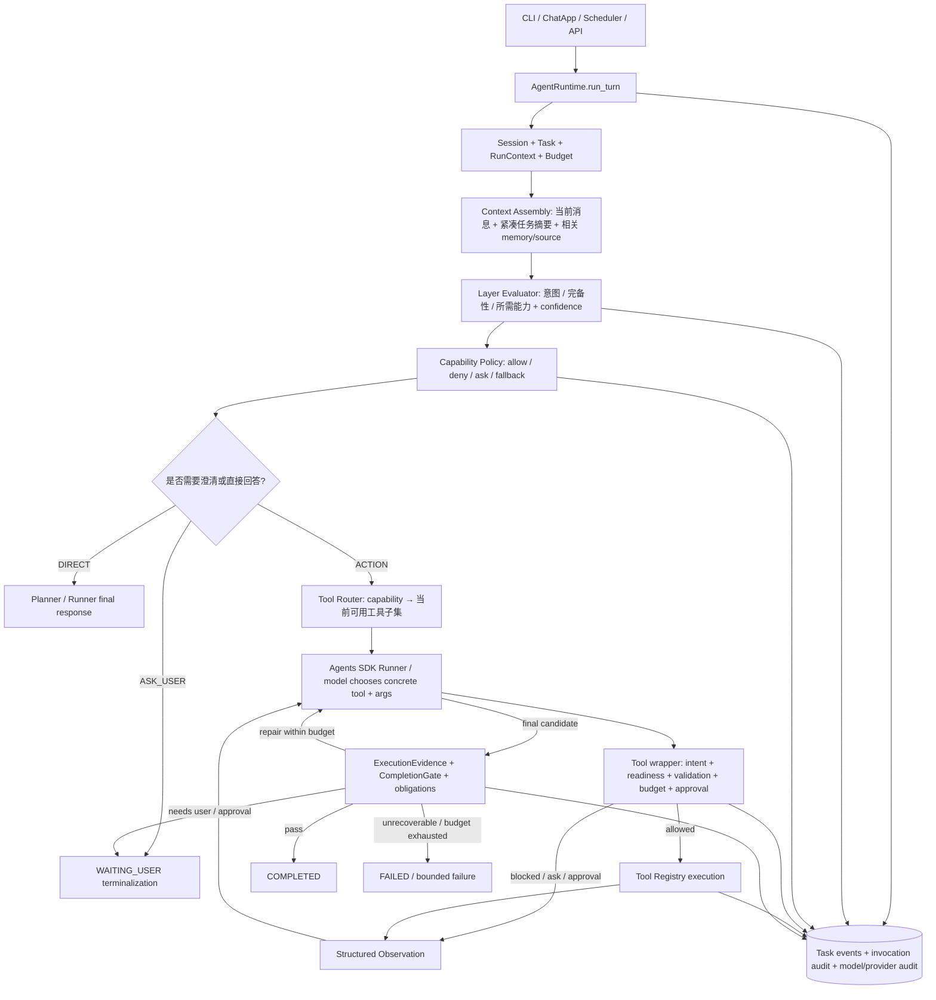

# Agent Runtime 底层架构与目标工作流方案

**日期：** 2026-09-26
**用途：** 在 [Agent Runtime + Layer 审计报告](../audits/AGENT_RUNTIME_LAYER_AUDIT_2026-09-26.md) 基础上提出目标结构、决策协议和修复顺序。
**性质：** 设计方案，不是实现报告；本文件不改变 Runtime 行为。
**约束：** 保留当前单 Agent + Agents SDK Runner 主循环，复用 TaskManager、RunContext、Tool wrappers、ApprovalGate、ExecutionEvidence、CompletionGate 与 terminalization；不另起一套并行执行内核。

## 1. 设计结论

当前 Agent 不是“没有 Runtime”：它已经有单 Run 生命周期、模型循环、工具包装、安全/审批门、执行证据、完成判定和任务状态终止。真正的问题是决策来源分散，Layer 的职责比设计文档窄，独立七阶段 pipeline 与生产入口断开，候选工具的筛选缺少统一结构化决策和可回溯 trace。

目标设计继续使用 `AgentRuntime.run_turn` 作为唯一生产 Run owner，使用 Agents SDK Runner 作为模型与工具循环。新增/整理的是一套轻量的**确定性 Run Controller 决策外壳**：把请求阶段的分类、能力规划、工具候选集、澄清要求、审批结果、ExecutionEvidence 与终态事件关联起来；Controller 不直接执行工具、不取代 Planner、不重写现有安全门。

核心原则：

1. **一个 Run owner：** 新建、resume、cancel、预算、终态只归 `AgentRuntime`/TaskManager 管。
2. **一个执行循环：** 工具调用与 Observation/Replan 继续使用现有 Runner loop；目标方案不并行引入第二个 `while True`。
3. **分清“判断”与“授权”：** Laya 可以提出概率判断；Capability Policy 生成候选能力；Tool Router 将能力映射成可用工具；执行 Gate 决定具体调用是否可执行；ApprovalGate 决定是否需要人批准；CompletionGate 根据事实决定是否完成。
4. **工具可见不等于工具获准执行；工具成功不等于任务完成。**
5. **失败可回退但不可静默抹掉：** 分类失败可回 Planner/关键词保守候选集；必须记录 fallback 原因。不得以任意异常为由无日志开放所有写入工具。
6. **每个决策都可复算：** `run_id/step_id/decision_id` 从 Layer 直到实际 invocation、Observation、terminal reason 可关联。

## 2. 目标架构



**说明：** 这里的 Planner 是现有模型在 Runner loop 中的 action selection 与 replanning，不是另建一个独立 LLM Planner 调用。Runner 仍控制协议级工具循环；确定性 Controller 只负责本轮工具暴露策略、必要的用户澄清与终态交接。

## 3. 目标工作流：一轮请求从进入到收口

### 阶段 A：入口、Run 身份与上下文准备

1. 所有生产交互入口传入 `run_turn(message, session_id/container_id, channel, attachments, task_id?)`。benchmark、API、CLI 可有各自适配层，但不能自行复制工具执行、审批和完成逻辑。
2. `AgentRuntime` 获取/创建 Task container，创建或恢复 Run，给当前请求生成关联的 `run_id`、`request_id`、`step_id`。状态变更仍只走 TaskManager transition。
3. 解析 provider/model profile、wall/token/turn/tool budgets、workspace/FileScope、approval state。
4. 组装 Layer 所需的最小上下文：当前用户消息 + 最近未决问题/任务摘要 + 已确认的必要实体（路径、时间、对象、执行阶段）+ 当前 Run 已完成能力。不要把全部长历史、所有工具结果或所有长期 memory 默认交给分类器。

### 阶段 B：Layer 只产出结构化建议

统一输出为 `LayerDecision`（建议协议）：

```json
{
  "intent": "action | direct_answer | conversation | ask_user | unsupported | unknown",
  "required_capabilities": ["SEARCH", "FILE_WRITE", "REMINDER"],
  "optional_capabilities": ["MEMORY_RETRIEVAL"],
  "dependencies": [["SEARCH", "SYNTHESIZE"], ["SYNTHESIZE", "FILE_WRITE"], ["FILE_WRITE", "REMINDER"]],
  "missing_fields": ["reminder_time"],
  "confidence": {"intent": 0.94, "capability:SEARCH": 0.91},
  "reason_codes": ["explicit_search_verb", "explicit_file_destination"],
  "source": {"model": "laya-checkpoint-id", "version": "..."},
  "fallback": null
}
```

输出必须 schema validation；unknown capability 不可默默映射为工具。Laya 不生成工具参数、不直接调用工具、不宣告任务完成。

**推荐的上线职责：**

- 第一阶段将 Laya 作为 shadow/advisory classifier，不允许它单独把请求短路为零工具。
- Capability Policy 综合 Layer、显式动词/对象、附件类型、任务状态和硬规则，生成 `allowed_capabilities` 与 `blocked_capabilities`。
- 用户明确 Action 但模型置信度低、Layer timeout/schema error、或多标签冲突时，保留可解释的保守候选集交给 Planner；对缺少必需执行字段则进入 ask/readiness 逻辑。
- 只有经独立 benchmark 证明 direct-answer false negative 极低，并且可被 fallback/用户纠正，才允许高置信 DIRECT 关闭工具候选；也可以选择永远不让 classifier 执行这一硬短路，由静态明确规则/Planner 决定。

### 阶段 C：Capability Policy 与候选工具生成

能力名与具体工具名解耦。初期 capability taxonomy 应覆盖：`WEB_SEARCH`, `SOURCE_RETRIEVAL`, `FILE_READ`, `FILE_WRITE`, `CODE_EXECUTION`, `MEMORY_WRITE`, `MEMORY_RETRIEVAL`, `REMINDER_CREATE`, `REMINDER_MANAGE`, `ASK_USER`, `DIRECT_ANSWER`, `UNSUPPORTED`。附件/图像/表格可以先作为输入模态/工具 capability，不把每个工具都变成 Layer 类别。

Policy 输出决定：

- `required_capabilities`：为了满足请求必须执行的能力。
- `optional_capabilities`：允许但不是任务成功必要条件的能力。
- `allowed_tools`：由 registry capability metadata 映射出的工具名集合。
- `blocked_tools` 和原因：硬规则、用户约束、缺能力或策略限制。
- `clarification_requirements`：缺字段、冲突或无法安全确定的对象。
- `fallback_mode`：继续 Planner、ask user、direct response、unsupported/refuse。

Tool Router 的职责收敛为纯集合映射/裁剪：`capabilities + registry + request risk + channel policy → allowed_tools`。它不再独立做一次“是否应该 Action”的语义判断。现有关键词表可先作为 capability evidence provider 之一，保留其命中规则、逐步迁移成可测 policy features。

候选工具约束：

- 不得将未经策略批准的工具重新注回 Agent.tools。
- 只读/发现工具可按 policy 自动可见；写文件、Memory write、Reminder、Code Execution 仍由 intent/readiness/approval/risk gate 再授权。
- `TOOL_ROUTER_FAST`、C2 escalation、能力盘点全工具路径必须成为 policy 显式的 `fallback_reason`/mode，并受安全白名单约束；“全量”也不得使未授权副作用工具越过执行门。
- 同一 Run 的后续阶段可更新能力集合，但每次扩展必须记录原因（例如 SEARCH 结果已确认目标文件，需要 FILE_WRITE）；不能把上一轮 Layer 结果直接当永久权限，也不能每步无状态重分类导致抖动。

### 阶段 D：Planner/模型选择具体工具

1. 通过克隆的 `Agent.tools=allowed_tools` 把候选工具 schema 交给现有 Runner/Provider。
2. Planner 根据请求、紧凑上下文、policy rationale 与此前 Observation，选择具体工具和参数，或直接回答/追问。
3. 它只能在当前候选集合里选择；Policy 不替 Planner 生成参数。对复杂多能力任务，Planner 负责选择当前可执行依赖前沿中的动作，不把后续所有动作强行一次排死。
4. 每轮模型调用保留实际送出的工具 schema fingerprint 和 tool names，以证明 `Agent.tools == provider tools`。

### 阶段 E：执行门与工具调用

每次调用按固定顺序检查：

1. invocation 是否来自当前 Agent/Registry 且 schema 正确；参数 JSON 解析和类型/必需字段验证。
2. 原始用户请求是否授权这类动作，用户是否明确禁止；依赖/目标是否具备。
3. RunContext 预算、重复调用、收敛、取消状态是否允许。
4. side effect/risk 是否需要 ApprovalGate；确认/拒绝状态与 invocation_id/run_id 绑定。
5. 执行只调用一处 Registry binding；规范化结果为 `ToolObservation(status=success|blocked|error|timeout|cancelled, result, evidence, retryable, side_effect_state)`。
6. 任何真实执行、blocked、异常、重试和 approval 都要形成同一 invocation ID 的审计记录；重试需要 `retry_reason`，副作用调用必须基于幂等键或禁止自动重试。

明确区分 blocked feedback 与成功结果。SDK 把错误字符串当普通 Observation 的情况要转换为明确错误状态，避免模型将错误文本当成功事实。

### 阶段 F：Observation、继续/重规划与完成

- 工具结果通过 Runner 原生 tool result 进入下一模型轮次；另将精简结构化 observation 写入 Run trace。
- Planner 继续、调用下一工具、请求澄清或提出 final answer；Runtime 的硬预算可拒绝继续并返回固定可解释观察。
- CompletionGate 仍是任务完成的确定性门：对必需 mutation/verification/source/问答义务检验真实 `ExecutionEvidence`；工具返回 success 不直接 terminalize。
- Completion repair 必须有总次数/墙钟/token 预算；修复只对缺失义务有效，不应重复已经 committed 的不可幂等副作用。
- Terminalization 单点分类：`COMPLETED`, `WAITING_USER`, `WAITING_APPROVAL`, `FAILED`, `CANCELLED`。内部 reason 再细分 `continue/retry/replan/timeout/budget_exhausted/no_progress/unsupported`，避免用模糊 enum 替代状态机。

### 阶段 G：持久化、记忆与可观测性

- Conversation history 存在当前 Session；执行事实、RunContext/义务与终态在 task/run store；长期 Memory 只通过显式记忆能力读写；检索来源带 source IDs；Layer 过程决策作为 `task_events`/专门的 decision table 记录，不将每个分类结论当长期记忆注入。
- 每个进入模型的非静态上下文块可记录来源/摘要 hash/版本；敏感原文沿用审计脱敏策略，Layer query 不应另造未脱敏日志出口。
- `run_plan` 不应在闭环证明前新增独立真相表。如果确需 step plan，先将其定义为派生审计事件/表并说明和 `tool_calls`、`task_events` 的 canonical relationship，防止第二套执行账本。

## 4. 组件职责矩阵（目标单一责任）

| 组件 | 只负责 | 不负责 |
|---|---|---|
| Entry adapters | 输入归一化、附件/渠道元数据 | 建第二套执行/审批循环 |
| `AgentRuntime` | Run/Task 生命周期、resume/cancel、预算装配、最终交接 | 语义猜工具、直接执行工具 |
| Context assembler | 当前输入与必要 task/session/source/memory 摘要 | 决定是否授权副作用 |
| Layer evaluator | intent/capability/completeness 概率判断与 reason | 具体工具参数、执行权限、完成判定 |
| Capability Policy | 确定 allow/block/ask/fallback、风险与阶段依赖 | 预测模型回复、调用工具 |
| Tool Router | Registry capability→Agent 可见的 tool subset | 再做 intent 分类/预算/审批 |
| Planner（当前 LLM/Runner loop） | 当前具体 action/tool/args、读取 observation、继续/结束提案 | 绕过候选 set 或硬 Runtime gate |
| Tool wrapper/Registry | 参数校验、执行授权门、规范化 tool invocation/result | 决定整任务完成 |
| ApprovalGate | 特定副作用的人工批准生命周期 | 普通只读 tool 语义路由 |
| ExecutionEvidence | 建立执行与验证事实 | 判断意图或生成“做过了”的文字 |
| CompletionGate | 依据 obligation/evidence 判任务是否可以完成 | 工具候选选择 |
| Terminalization/TaskManager | 唯一合法 Task state transition 与终态记录 | 静默覆盖原终态 |
| Observability | 将决策、调用、证据、状态转移关联 | 创造第二套可影响执行的状态 |

## 5. 状态机建议

Task 状态仍沿用现有持久状态。Run 内部过程增加明确 `step_phase`，不是新增平行 TaskState：

```text
RECEIVED
  → CONTEXT_READY
  → POLICY_DECIDED
  → PLANNER_RUNNING
  → TOOL_PENDING → TOOL_BLOCKED/TOOL_FAILED/TOOL_SUCCEEDED
  → OBSERVATION_READY → PLANNER_RUNNING
  → COMPLETION_CHECK
  → COMPLETED | WAITING_USER | WAITING_APPROVAL | FAILED | CANCELLED
```

transition invariants：

- `TOOL_SUCCEEDED` 只是 invocation 事实，不是 task complete。
- `WAITING_APPROVAL` 只由 pending approval 导致；批准 resume 后使用同一 Run/invocation identity，避免重复 side effect。
- `WAITING_USER` 必须带结构化 question 与 missing fields；用户回复形成新的 Run 或明确恢复操作，不能自动把旧答案猜入原 invocation。
- `FAILED` 要有不可恢复错误/预算耗尽/完成义务缺口等 reason；可恢复 provider/tool error 由有限 retry policy 处理。
- `CANCELLED` 终止后不得继续执行 pending tools；已发生副作用事实须保留。
- 完成后不再向 Planner 派发工具；达到 step/turn/wall/token/tool cap 后 Runtime 进入明确 bounded terminal response。

## 6. Layer fallback 与置信度策略

| 情况 | Policy 行为 | 是否扩大工具面 | 是否终止 |
|---|---|---:|---|
| Layer 正常、高置信 Direct Answer，且无显式 Action/附件/未决任务 obligation | 候选可收窄，允许直接回答 | 否 | 否，仍要模型 answer 与适用的 final checks |
| 显式 Action 与 Layer direct-answer 冲突 | 以显式请求/安全规则为高权重 evidence；保留 action capability 或 ask | 只扩大到该 Action 白名单 | 否 |
| 低置信/多标签冲突 | 回静态 capability evidence + Planner fallback；必要时 Ask User | 不开放无关/副作用工具 | 否 |
| malformed/schema/unknown capability | 记录 classifier_error，回保守 Planner path | 只给安全基础工具及可识别 Action 的候选 | 否 |
| Layer timeout/model exception | 有时限降级到不依赖 Layer 的既有 Policy；记录 fallback | 不默认全量副作用工具 | 否 |
| 必需字段缺失/高风险目标模糊 | ASK_USER/readiness | 不执行目标 Action | 转 WAITING_USER |
| user explicit action refused by policy / capability unsupported | 明确拒绝或解释未执行 | 否 | `FAILED` 或产品定义的 completed refusal，须语义统一 |

阈值需按类别和风险单独校准，不能把一个 0.85 同时用于 Search、Memory、Reminder、Code、File、Ask User。Layer recall 对“用户明确要求执行”的 Action 类应优先，Direct Answer precision 用于降低无效模型/工具成本。高副作用类别的置信度不能取代显式用户授权、字段完整性和审批。

## 7. 数据与 trace contract

建议统一以下事件字段（复用现有 task event/audit，不要求一开始新建多张表）：

| 事件 | 必需字段 |
|---|---|
| `layer.decision` | task_id, run_id, decision_id, step, query_hash, input_scope, intent, required/optional capabilities, confidence, reason_codes, model/checkpoint/backend, latency, fallback/error |
| `policy.decision` | decision_id, allow/blocked capabilities, allowed/blocked tool names, risk class, ask requirements, fallback reason, policy version |
| `planner.decision` | model_call_id, decision_id, proposed action, selected tool, normalized args fingerprint, provider tools/schema fingerprint |
| `tool.invocation` | invocation_id, run_id, decision_id, tool/capability, args redacted/hash, status, latency, retry/idempotency, result fingerprint |
| `tool.observation` | invocation_id, status, normalized summary/source IDs, truncation metadata, retryable |
| `state.transition` | from, to, reason, step, actor, timestamp |
| `run.terminal` | final state, terminal reason, completion verdict, required obligations, evidence references, elapsed/cost/calls |

不得把原始敏感参数无脱敏地复制到第二个日志通道。Run terminal consistency checker 应对账 model calls、tool invocation IDs、approval、artifact、completion evidence，并对 missing invocation_id/双账本计数漂移告警。

## 8. Benchmark 与验收方案

### 测试层级

1. **Layer Behavior Benchmark（离线、独立）：** 每类有独立正负例、gold required/optional capabilities、missing fields、discussion/past-tense contrast、multi-turn state。输出 confusion matrix、per-class precision/recall/F1、FN/FP 原句、置信度分桶、校准误差。
2. **Policy/Router contract tests：** 输入 LayerDecision + Registry fixture，断言 allowed/blocked capability、具体工具集合、未知工具不泄漏、fallback 不开放不安全 side effects。
3. **Gate unit tests：** 每个 tool wrapper/access/approval/readiness/budget/error contract 独立测。
4. **Runtime integration tests：** 使用 fake provider 但保留真实 `run_turn`、RunContext、tool wrapper、ApprovalGate、CompletionGate、TaskManager，验证一条完整真实控制链。
5. **E2E behavior cases：** 明确标记真实 provider vs deterministic fake；有副作用的 E2E 使用隔离 workspace、临时数据库、mock 外网与人工 approval policy。
6. **Benchmark parity：** production evaluation 只能经 `run_turn`。绕过 Run owner 的低层 Runner benchmark 作为 planner/model unit benchmark，不宣称生产通过率。

### 首轮验收矩阵

| 类别 | 正例/易错点 | 必须检查 |
|---|---|---|
| Direct/chat | 普通知识、问候、普通聊天提 Tool 名 | 不开无关工具；回答不声称执行 |
| Search | 最新资讯/指定来源/不需要搜索的稳定知识 | 需要时召回、无需时不搜索、结果进入 Observation/source refs |
| File | read/edit、缺路径、多轮“继续” | FILE_READ/WRITE 候选正确；写入 gate/approval 仍在 |
| Code | 只要代码文本 vs 明确运行 Python | CODE_EXECUTION 召回区别清晰，权限按 policy 走 |
| Memory | “记住…”、回忆、讨论记忆、过去时 | 写/读/不执行三者区分；写后可回读 |
| Reminder | 明确时间、缺时间、讨论提醒、管理旧任务 | CREATE/MANAGE 分开；缺字段 ASK_USER；创建后有 scheduler evidence |
| Multi-capability | Search→synthesize→file→reminder | 依赖阶段更新候选、无漏能力/无重复动作 |
| Unsupported/high-risk | 无工具能力、发送/删除/外部副作用 | 不假装执行；确认/拒绝与终态正确 |
| Recovery | malformed Layer、timeout、provider/tool failure、cancel/resume | 有界降级、trace 完整、无假完成/重复副作用 |

### 初步质量门（上线前目标，不是当前指标）

- Action 总召回优先验收，并单独设 Memory/Reminder/Code/File/Ask User FN 上限；通过用户定义 gold benchmark 才可设具体百分比。
- 高风险副作用工具的 false-positive 直接执行为零：候选可见不算执行，所有调用仍需 intent/readiness/approval。
- Direct Answer 的错误短路必须接近零；如果无法证实，保留 advisory mode。
- Layer fallback 事件完整率 100%；工具调用 `invocation_id` 覆盖率 100%；Run terminal ledger reconciliation 无静默缺口。
- 多能力请求的 required capability coverage 达到所有 benchmark case 的 100% 后，再评估工具数/模型成本优化。
- 对相同数据集同时跑 Router-only baseline 与 Layer+Policy candidate；比较 model calls、tool calls、search calls、duplicate calls、steps、false Action、missing Action、完成率与延迟。任何成本收益不能以 Action FN/错误副作用增加换取。

## 9. 实施 Roadmap 与依赖关系

### Phase 0 — Baseline/契约定义（无运行行为变化）

- 冻结本审计报告样本；补齐 Layer 真实评估集来源和 gold labels。
- 建立 capability registry 数据表/映射文档，与工具 schema、side-effect/risk metadata 一致性校验。
- 统一测试生产 `run_turn` 与低层 Runner benchmark 的用途。
- **退出条件：** 可复算当前分类表现；每个工具都有 capability、effect/risk、owner、approval、idempotency 属性。

### Phase 1 — Trace 闭环（无策略变化）

- 给现有 Laya screen、keyword Router、Agent.tools schema、实际 invocation 添加同一 decision/run correlation IDs。
- 记录 screen 被 skip、Layer fallback、C2 escalation、全量工具模式。
- 修正 router p95 指标和 ledger reconciliation；query 与 args 延续统一脱敏。
- **退出条件：** 抽取任一 Run 可从输入重建候选集、Provider tools、实际调用、结果、门状态和终态。

### Phase 2 — Layer shadow 与独立 benchmark

- 将 Laya classify 输出转 `LayerDecision`，处理 schema/unknown/timeout/confidence/fallback；不影响当前 Router 输出。
- 建 direct/search/tool/code/file/memory/reminder/ask/multi/unsupported 类 benchmark，分开统计 P/R/F1 与 FN 样例。
- **退出条件：** 测试可重复、模型/checkpoint 版本固定、每类指标可信；否则不进入 hard routing。

### Phase 3 — 统一 Capability Policy（仍不直接执行工具）

- 把现有关键词命中、Layer 候选、附件、task summary 合并为 evidence；确定性 Policy 计算 required/optional/allowed/blocked/ask。
- Tool Router 只做 Registry mapping，逐步退出“自己判断意图”的隐藏逻辑；保留显式 fallback mode。
- 能力盘点、TOOL_ROUTER_FAST、C2 全量升级走统一 policy 输出与日志，副作用执行门不变。
- **退出条件：** 同一 policy decision 在 shadow mode 可重算，集合稳定，无未解释全量 fallback。

### Phase 4 — 受限灰度硬约束

- 先对风险低、FN 代价低的 DIRECT/SEARCH 可见工具做候选裁剪；Memory/Reminder/Code/File Action 默认仅 advisory 或按高召回 allowlist。
- 对每一类做 canary 与快速回滚开关；模型不可调用 Layer 无权绕过审批/确认/参数门。
- 监控错误 direct、missing action、工具不可见、fallback、模型/工具 calls。
- **退出条件：** 无安全回归、关键 Action recall 达门槛、收益优于 Router-only baseline。

### Phase 5 — State-aware multi-step capability flow

- 建立 run-local capability progress 与 dependency frontier；完成 SEARCH 后可允许 FILE_WRITE，用户明确请求时 REMINDER 依赖正确字段。
- 每步策略更新有历史决策依据与防抖；恢复任务从 execution evidence/Run state 重建，不只靠重新分类。
- 若仍需 run_plan，先定义其为 trace projection，不另造可覆盖实际执行账本的 truth。
- **退出条件：** 多工具 case 收敛、无重复/无状态污染、resume/cancel/approval 真实链正确。

### Phase 6 — Reliability / parity / optimization

- 错误注入与 E2E 全矩阵；真实 provider 工具 schema parity；副作用 idempotency/retry/cancel。
- 加强 benchmark parity，所有生产验收路径经过 run_turn。
- 只有闭环 correctness 达标后，优化模型调用/工具数量/分类器 latency/context 体积。
- **退出条件：** 真实 Runtime trace 能解释任一动作，terminalization 无假成功，成本指标可归因且相对 baseline 改善。

## 10. 对既有七阶段设计的保留/调整

| 既有构想 | 目标方案处理 |
|---|---|
| Laya 前置快筛 | 保留为 classifier，但先 advisory/shadow；避免单一高置信类别直接清空工具 |
| 多标签能力选择 | 保留并要求 structured required/optional capabilities/dependencies；route tool head 未训练时用 policy+registry |
| Orchestrator 产唯一动作 | 保留“确定性 policy”思想，不采用独立执行 orchestrator；现有 Runner 已有执行循环 |
| LLM 参数补全 | 保留由 Runner Planner 产生参数；缺硬必需信息时确定性 ASK_USER，不允许猜副作用参数 |
| 七阶段独立工具执行回调 | 不作为生产第二执行链；功能折叠进当前 Runner/Tool Registry 链 |
| LLM 三向比较器 | 不新增重复 LLM completion judge；复用 CompletionGate+ExecutionEvidence。必要的内容质量评价只能作为非权威辅助信号 |
| LoopGate | 预算语义复用现有 RunBudget/RunContext/Runner max_turns/墙钟；不维护另一套 token/step 计数 |
| run_plan/folder_memory | 暂缓新建；先验证需求并定义数据所有权/清理策略；现有 Memory/RAG/Task events 优先复用 |
| 六类 Memory | 分开 conversation/session、Run working state、长期 user memory、source/index；只有用户请求或明确产品策略才写长期记忆 |

## 11. 关键未决设计决策

以下不阻止形成方案，但编码前应基于 benchmark 决定：

1. Laya 是否仅 shadow/advisory，还是未来允许对低风险请求强制收窄？建议先 advisory；任何直接回答短路都需要 FN 证据和高置信校准。
2. `DIRECT_ANSWER` 是否作为 capability，还是“无 required action capability”由 policy 推导？建议可有 intent，但不要把它与任务终态混为一谈。
3. 多轮连续任务应创建新 Run 还是恢复同 Run？当前批准/等待续跑已有 resume 语义；普通新消息应由 Task container history + completed capability evidence 建新 Run，避免把旧 Layer 权限跨 Run 继承。
4. 何种副作用要求确认？继续以 registry effect/risk + explicit user intent + ApprovalGate 策略为准，并用一致性测试防 `spec.py` 与 `approval.py` 漂移。
5. Memory 与 Reminder 的表达歧义及读取 scope：需测试覆盖个人偏好写入/取回、对过去行为的描述、讨论能力和真实执行请求。

## 12. 最终目标

用户可以从一个 Runtime trace 清楚回答：用户要求了什么；Layer 看到了哪些上下文并作出什么置信判断；Policy 因何允许/过滤能力；Planner 从哪些工具中选择了什么；每个参数为何合法；工具到底执行、阻塞还是失败；Observation 是否进入下一轮；任务为何继续、等待、完成或失败；副作用是否仅发生一次；benchmark 是否走了相同的生产控制门。

达到这些条件前，Layer 相关的任何准确率或节省成本数字都只能称为局部实验结果，不能当作 Agent 生产能力结论。
