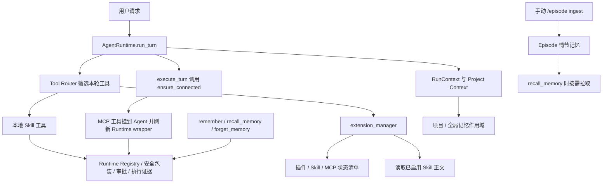

# 插件、Skill、记忆与 Agent 接入审查

- 日期：2026-09-27
- 范围：当前提交代码的静态审查
- 基线：`319f8ce` (`fix: harden API runtime and TUI workflows`)
- 限制：未读取 `.env` 值；未启动 Agent、Provider 或真实 MCP 子进程；未运行测试。本报告能确认代码接线和已有离线测试覆盖，不能证明本机当前配置下外部服务实际在线。

## 结论

插件、Skill、长期记忆和项目记忆都接入了 Agent 主工作流，但“接入”层次不同：本地 Skill 工具与记忆工具随 Agent 创建时注册；MCP 服务在首次执行时按配置连接并动态挂载；Skill 正文按需读取；情节记忆（Episode）由用户拉取，数据则需手动采集。

主要接线完整性问题：MCP 连接失败后当前进程不会自动重试；记忆关闭开关只阻止写入；全局记忆模式下 `remember` 的成功提示称同时写入项目记忆，实际代码只写全局表；Episode 不会随 Run 自动采集；`skill-assets` 没检查目标 Skill 是否启用。

## 接入关系

## 1. 插件与外部工具

### 当前结构

- 本项目没有通用的“任意插件安装/卸载运行时”。`extension_manager` 只提供清单查询和已启用 Skill 指引加载（`integrations/extensions.py:10-24`）。本地插件工具实际由 Skill 目录中的 `tools.py` 提供。
- MCP 是外部服务连接层：由 `MCP_SERVERS` 配置，`FORGE_MCP_ALLOWLIST` 可收窄服务器；每项工具用 `allow / approval / deny` 策略控制（`integrations/mcp_bridge.py:68-126`）。
- Runtime 从 Agent 工具列表发现来源并登记；MCP 用 `_mcp_source` 标记，本地 Skill 工具用 `_tool_origin="plugin"` 标记（`runtime/registry.py:64-83`）。真实调用再经过 Runtime 包装、策略、记账。
- MCP 在 `runtime/execution.py:252` 的每轮执行前调用 `ensure_connected()`。成功工具会挂到 Agent 并调用 `refresh_tool_wrappers()`（`integrations/mcp_bridge.py:363-376`）。
- `extension_manager(action="list")` 根据当前 Agent 注册对象和 MCP 连接状态返回清单；能反映注册/连接状态，但“已配置”本身不等于“服务可调用”。

### 发现

1. **P2：MCP 连接失败在当前进程内不会自动重试。** `ensure_connected()` 对每个连接异常记录后继续，但最后仍把 `_connected=True`（`integrations/mcp_bridge.py:356-377`）。后续每轮调用一开始就返回成功态，不会重试失败服务；状态只能显示未连接，恢复通常要重启/关闭后重新连接。对于启动时临时故障，这会造成服务整段进程生命周期不可用。
2. **P2：Skill 工具和说明是启动期快照。** `agent.py:63-64` 在模块导入时收集 `SKILLS` 并生成目录块；`_build_assistant_agent()` 将两者注入 Agent（`agent.py:223-276`）。运行期间新增 Skill 或修改启用列表不会同步刷新已注册工具/Agent 指令，需重启进程。按需加载是指完整正文不常驻模型上下文，并非工具热插拔。
3. **P2：Skill 资源读取工具没有限制 Skill 必须启用。** `skills/skill-assets/tools.py:24-48` 只校验 Skill 目录与路径边界，没有核对 `SKILLS` 启用名单；启用了 `skill-assets` 后，模型可读取仓库中其他未启用 Skill 的文本资源。工具不会执行这些文件，但“只访问已启用技能”的权限边界没有落实。
4. **P3：插件管理能力范围较窄。** 清单/状态工具没有安装、卸载或动态启停能力。扩展接入依靠改 `.env`、Skill 文件或外部 MCP 命令，并通常重启进程。这是当前设计边界，不应把它描述成完整插件市场。

## 2. Skill 技能

### 当前结构

- 启用来源是 `.env` 的 `SKILLS=name1,name2`；目录在 `skills/<name>/`，主要文件是 `skill.md`/`SKILL.md`，可选 `tools.py`（`skills_loader.py:23-66`）。
- Agent instructions 注入轻量目录，模型通过 `extension_manager(action="load_skill", name=...)` 读取被启用 Skill 的完整正文（`skills_loader.py:156-190`、`integrations/extensions.py:10-22`）。
- 已启用 Skill 中的 `FunctionTool` 在启动时导入，并进入 `agent.py` 的工具列表；Runtime Registry 区分来源，之后仍由 Tool Router 按当前请求裁剪。
- Skill `tools.py` 的 symlink 和解析路径越界检查已存在（`skills_loader.py:205-245`）。

### 发现

- **连接结论：Skill 能进入 Agent 工作流，但不会自动成为当前每轮可用工具。** 启用 Skill 指引通过加载工具取回；Skill 工具还要经过 Tool Router 候选筛选。Agent 指令列出目录并不保证模型一定触发，也不保证工具必然被 Router 召回。
- `extension_manager` 清单将 Skill 目录元数据视为发现提示，不把其内容当行为规则；完整正文需显式加载。这一边界设计明确。
- 离线测试已有 `tests/test_skills_loader.py`（启用发现、工具收集、未知 Skill、symlink）和 `tests/test_skill_gorden_ppt.py`（Skill 工具经 Runtime 路径）；本次只确认测试源存在，未重新运行。

## 3. 记忆

### 当前结构

- 主 Agent 原生挂载 `remember`、`recall_memory`、`forget_memory`（`agent.py:235-276`），Runtime Tool Router 按保存、回忆、删除意图分别开放（`runtime/tool_router.py:596-709`）。
- 长期记忆默认写入 `agent.db` SQLite；旧 `memory.json` 有迁移兼容路径（`tools.py:25-38, 335-426`）。
- 每轮 Run 从 task container 取 `memory_scope`，绑定到 RunContext；记忆工具优先从 RunContext 读取作用域（`runtime/runner.py:2684-2695`、`tools.py:64-75`）。`project_only` 只读写当前项目；`global` 可读全局并读取本项目记忆。
- 项目说明、来源、项目记忆会通过 `_project_context_block()` 注入当前项目 Run（`runtime/runner.py:2159-2190, 2808`）。Run 清理路径会清理记忆绑定并 reset RunContext（`runtime/runner.py:3258-3260, 3443-3455`）。
- Episode 情节记忆仅包含脱敏/聚合后的历史执行统计。它由 `recall_memory` 按需 pull（`tools.py:553-625`）；写入采集由 `/episode ingest` 手动触发（`cli/commands.py:350-378`），没有发现 Agent Run 终态自动调用 `ingest_pending()`。

### 发现

1. **P2：关闭长期记忆开关并未关闭读取、删除和项目上下文注入。** `FORGE_MEMORY_ENABLED` 只在 `remember()` 中检查（`tools.py:59, 447-449`）；`recall_memory()`、`forget_memory()` 没有此检查，项目记忆还会在 Run 开始时注入。若“关闭”含义是禁止所有记忆访问，当前实现不符合；若只想禁写，需要更准确地命名和提示。
2. **P2：全局记忆模式下写入反馈与实际写入不一致。** `remember()` 在 `memory_scope="global"` 时只走全局 `_save_memory()`，随后却返回“同时已记入本项目记忆”（`tools.py:455-477`）；此路径没有调用 `add_project_memory()`。记忆会出现在全局召回中，但不会成为项目记忆行/Project Context 项目记忆。
3. **P2：Episode 学习不是自动贯穿 Run。** 正常 Run 会产生 terminal 事件，但没有找到自动采集调用；需操作员另行执行 `/episode ingest`，之后模型还须触发 Router 允许的 `recall_memory` 才会看到历史执行统计。因此这是可选的人工维护召回能力，不是自动经验学习。
4. **低风险边界：记忆无 RunContext 时回退到全局个人记忆。** 该回退兼容旧调用/测试；完整 Agent Run 正常会绑定 RunContext。直调工具、独立脚本或脱离 Runtime 的调用仍可能走全局作用域，调用边界需继续保持收敛。

### 已有测试

- `tests/test_memory_store.py`：CRUD、重复项更新、密钥拦截、容量和 JSON 兼容。
- `tests/test_project_model.py`：project_only 不读取全局/其他项目、global 读全局及 Project Context。
- `tests/test_p1_reliability.py`：并发 RunContext 的项目/全局作用域不串。
- 未发现覆盖“global remember 同时写入项目”的测试；现有测试也没有证明 Run 完成时自动 Episode ingest。

## 总体判定

| 能力 | 与 Agent 的接入状态 | 自动程度 | 本机当前服务状态 |
|---|---|---|---|
| 本地 Skill 文本 | 已接入；按需由模型加载 | 需配置启用、任务匹配、模型调用加载工具 | 未核当前 `SKILLS` 配置值 |
| Skill Python 工具 | 已接入 Runtime Registry/Router/安全包装 | 启动期加载，需被 Router 选中 | 未核当前启用集合；修改后需重启 |
| MCP | 已接入 Agent 执行链，配置后连接并挂工具 | 首次执行连接；失败不会当前进程自动重试 | 未启动本机 MCP 服务，不能声称在线 |
| 长期/项目记忆 | 已接入原生工具与项目 RunContext | 按需回忆/写入；项目记忆可注入上下文 | 数据库与本机数据内容未读取 |
| Episode 记忆 | 可由 `recall_memory` pull | 采集需手动 `/episode ingest` | 未核数据库中是否已有 episode 记录 |

**最终判断：代码层面的接线基本成立；运行态的具体启用配置和外部连通状态本轮未验收。** 在真正工作流里，插件/Skill 要经过 Router、MCP 要连接成功，记忆要命中正确 scope；“有目录、有工具定义、有配置示例”都不能替代运行态可用性的证明。

## 修复回顾（2026-09-27）

用户随后要求修复插件发现问题，以下 三项已在工作区修改：

1. MCP 首次连接失败会记录失败服务器，并在默认 30 秒冷却后按服务器重试；成功服务器不会重复启动/挂载。可由 `FORGE_MCP_RETRY_INTERVAL_SECONDS` 调整冷却时间。已有连接后来断开的主动健康探测不在本次修复范围。
2. 新增 `extension_manager(action="refresh_skills")`，会重读项目 `.env` 的 `SKILLS`（若进程启动时存在不同的外部环境覆盖，则沿用外部值），重新扫描并导入启用 Skill 的本地 `tools.py`，同步 Agent 指令/工具、Runtime wrapper 与 Registry。Agent 模型缓存重建时保留已挂载 MCP 工具。
3. Runtime 工具包装保留 `_tool_origin` 来源标记；`skill-assets` 现在只读取启用 Skill，并拒绝 Skill 目录符号链接和解析越界路径。

验证：受影响 Python 模块 `py_compile` 通过，`git diff --check` 通过；遵循本轮工作限制，没有运行测试或连接真实 MCP/Provider。改动尚未提交。

### Skill 边界补充修复（2026-09-27）

- 启动时读取 Skill 正文和收集工具现在共用目录校验：拒绝 Skill 目录自身为符号链接、解析后不是 `skills/` 的直接子目录，以及 Skill 指令文件是符号链接或解析越界。此前只在 Skill Python 工具和 `skill-assets` 路径上覆盖了部分符号链接边界。
- `refresh_enabled_skills()` 现在把 Runtime wrapper/Registry 刷新异常返回为 `runtime_error`，避免 Agent 工具列表已更新但 Runtime 同步失败时静默显示为完整刷新。
- Skill 相关请求会额外匹配已启用 Skill 的名称/触发描述，并将对应的已注册工具放入 Router 候选；普通不相关请求仍不加载 Skill 工具。
- 本次补充修改尚未做动态 Skill 工具执行或刷新故障注入验收；仅进行静态检查。

### 记忆契约修复（2026-09-27）

- 新增统一 `runtime.memory_policy`。`FORGE_MEMORY_ENABLED=0` 现在会关闭长期/项目/情节记忆工具调用、工具路由、项目记忆上下文注入、Episode 召回及自动采集；CLI 的 ingest/reindex/recall/clear 也遵守总开关。`EPISODE_INGEST=0` 只停自动采集，手动补采仍可用；`EPISODE_RECALL=0` 只停历史经验召回。
- 全局记忆模式下，`remember` 会将事实写入个人全局记忆及当前项目记忆；重复内容会更新当前项目副本，失败回执会明确区分已成功/未成功的写入。
- `forget_memory` 仅在记忆启用时可用；项目记忆 ID 只能由 Run 当前绑定的项目删除；`project_only` 下拒绝删除全局记忆。
- `TaskManager` 在 `run.terminal` 事件已持久化后触发 Episode best-effort 采集，错误只记录日志，不回滚终态。保留 `/episode ingest` 手动幂等补采。
- 静态检查通过；未运行测试或故障注入。自动 Episode 采集位于终态事件写入后的同步 best-effort 调用，可能增加少量收口延迟；失败不改变任务状态，但仍需动态验收数据库繁忙/损坏等情况。
